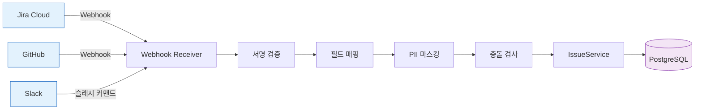
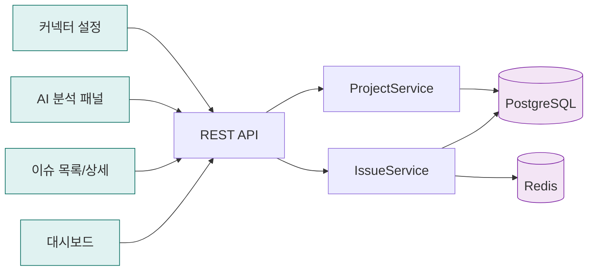
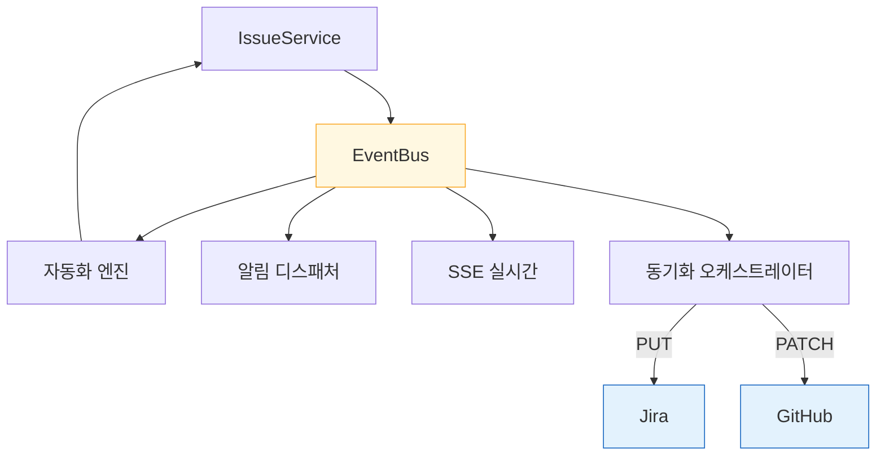
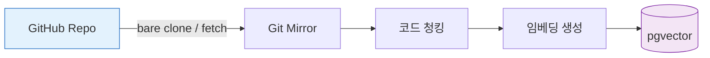
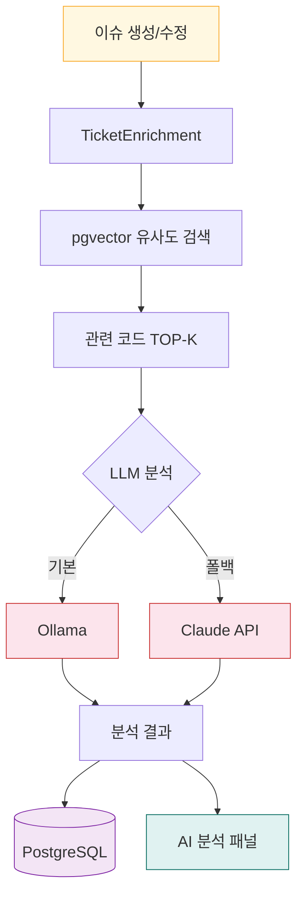
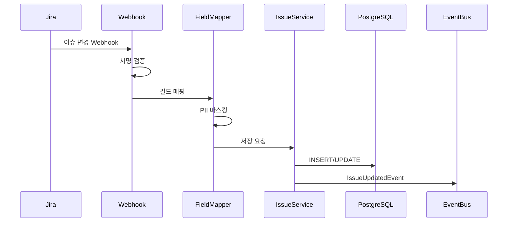
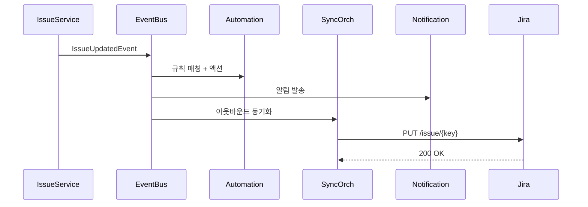
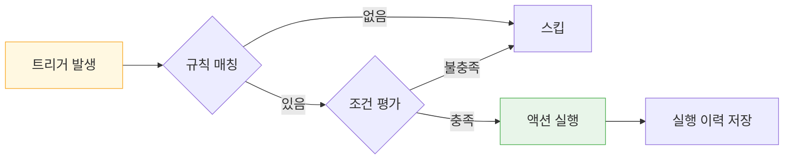

# IssueHub 데이터 플로우 (Data Flow)

> 외부 시스템 <-> IssueHub <-> AI 분석 파이프라인 데이터 흐름을 섹션별로 분리

---

## 1. 인바운드 데이터 흐름 (외부 -> IssueHub)

---

## 2. 프론트엔드 <-> API

---

## 3. 이벤트 후처리

---

## 4. AI 코드 인덱싱 (백그라운드)

---

## 5. 이슈 AI 분석

---

## 6. 이슈 동기화 시퀀스

### 6-1. 인바운드 (Jira -> IssueHub)

### 6-2. 이벤트 후처리 + 아웃바운드

---

## 7. 자동화 규칙 실행

