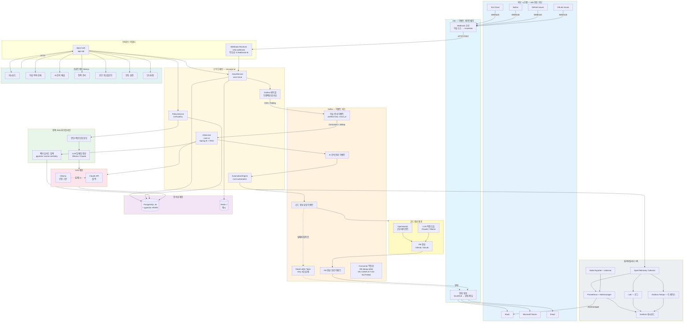
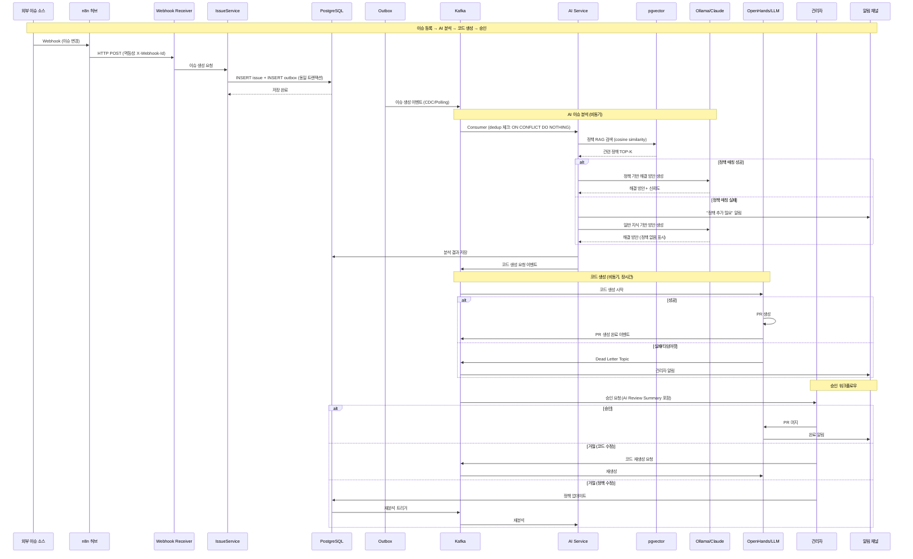

# IssueHub 데이터 플로우 (Data Flow)

> MVP 기획서 기반 이벤트 드리븐 아키텍처 데이터 흐름
> 최종 수정: 2026-04-09

## 1. 전체 시스템 데이터 플로우

## 2. 이슈 처리 이벤트 체인 (시퀀스 다이어그램)

## 3. 이벤트 드리븐 설계 원칙

| 원칙 | 구현 방법 |
|------|----------|
| 트랜잭션 원자성 | Transactional Outbox 패턴 (DB저장 + Outbox 동일 트랜잭션) |
| 이벤트 발행 | Debezium CDC 또는 Polling Publisher로 Outbox → Kafka |
| Consumer 멱등성 | DB deduplication 테이블 (event_id UNIQUE constraint + `INSERT ... ON CONFLICT DO NOTHING`) |
| 파티션 키 | issue_id로 동일 이슈 이벤트 순서 보장 |
| 실패 처리 | Dead Letter Topic + 재처리 정책 (retry 3회 → DLT → 관리자 알림) |
| 타임아웃 | OpenHands 호출 타임아웃 설정 + 무응답 시 DLT 이동 |
