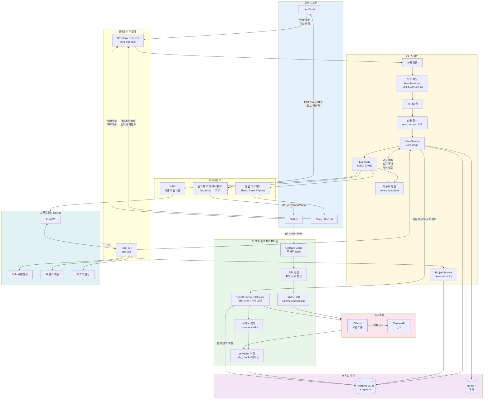
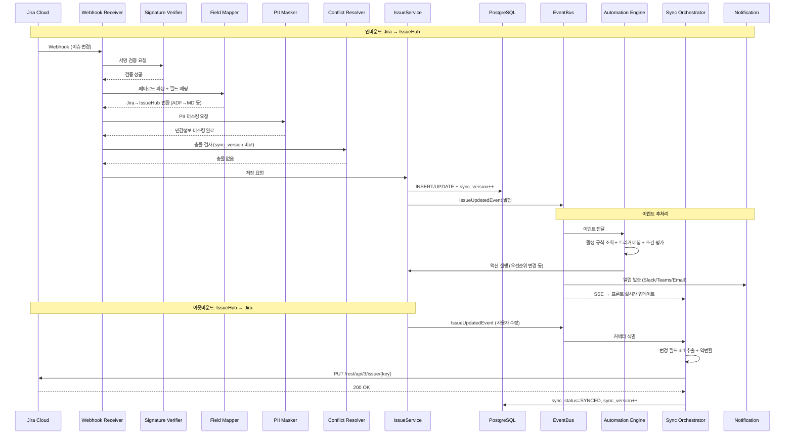
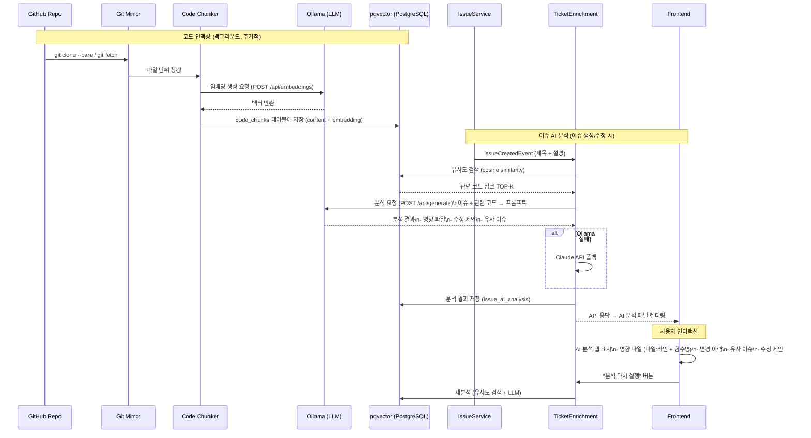
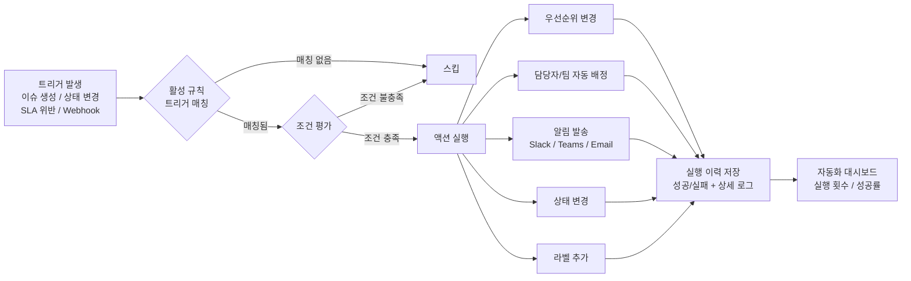

# IssueHub 데이터 플로우 (Data Flow)

> 외부 시스템 ↔ IssueHub ↔ AI 분석 파이프라인 전체 데이터 흐름

## 1. 전체 시스템 데이터 플로우

```mermaid
flowchart TB
    subgraph EXTERNAL [외부 시스템]
        JIRA[Jira Cloud]
        GITHUB[GitHub]
        SLACK[Slack / Discord]
    end

    subgraph INBOUND [인바운드 어댑터]
        WH_RECEIVER[Webhook Receiver\ninfra-webhook]
        REST_API[REST API\napp-api]
    end

    subgraph CORE [코어 도메인]
        direction TB
        SIG_VERIFY[서명 검증]
        FIELD_MAP[필드 매핑\nJira↔IssueHub\nGitHub↔IssueHub]
        PII_MASK[PII 마스킹]
        CONFLICT[충돌 검사\nsync_version 비교]
        ISSUE_SVC[IssueService\ncore-issue]
        PROJECT_SVC[ProjectService\ncore-connector]
        AUTO_ENGINE[자동화 엔진\ncore-automation]
        EVENT_BUS[EventBus\n도메인 이벤트]
    end

    subgraph PERSISTENCE [영속성 계층]
        PG[(PostgreSQL 16\n+ pgvector)]
        REDIS[(Redis 7\n캐시)]
    end

    subgraph AI_PIPELINE [AI 코드 분석 파이프라인]
        direction TB
        GIT_MIRROR[Git Bare Clone\n주기적 fetch]
        CODE_CHUNK[코드 청킹\n파일 단위 분할]
        EMBEDDING[임베딩 생성\nOllama embeddings]
        VECTOR_STORE[pgvector 저장\ncode_chunks 테이블]
        SIMILARITY[유사도 검색\ncosine similarity]
        ENRICHMENT[TicketEnrichmentService\n영향 파일 + 수정 제안]
    end

    subgraph LLM_LAYER [LLM 계층]
        OLLAMA[Ollama\n로컬 기본]
        CLAUDE_API[Claude API\n폴백]
    end

    subgraph OUTBOUND [아웃바운드]
        SYNC_ORCH[동기화 오케스트레이터\nIssueHub → 외부]
        NOTIF[알림 디스패처\nSlack / Email / Teams]
        SSE[SSE\n프론트 실시간]
    end

    subgraph FRONTEND [프론트엔드 Next.js]
        FE_DASH[대시보드]
        FE_ISSUES[이슈 목록/상세]
        FE_AI[AI 분석 패널]
        FE_CONNECTOR[커넥터 설정]
    end

    %% 인바운드 흐름
    JIRA -->|Webhook\n이슈 변경| WH_RECEIVER
    GITHUB -->|Webhook\nPR/이슈| WH_RECEIVER
    SLACK -->|/issue create\n슬래시 커맨드| WH_RECEIVER

    WH_RECEIVER --> SIG_VERIFY
    SIG_VERIFY --> FIELD_MAP
    FIELD_MAP --> PII_MASK
    PII_MASK --> CONFLICT
    CONFLICT --> ISSUE_SVC

    %% 프론트엔드 → API
    FRONTEND -->|HTTP| REST_API
    REST_API --> ISSUE_SVC
    REST_API --> PROJECT_SVC

    %% 코어 → 영속성
    ISSUE_SVC --> PG
    ISSUE_SVC --> REDIS
    PROJECT_SVC --> PG

    %% 이벤트 발행
    ISSUE_SVC --> EVENT_BUS
    EVENT_BUS --> AUTO_ENGINE
    EVENT_BUS --> NOTIF
    EVENT_BUS --> SSE

    %% 자동화
    AUTO_ENGINE -->|규칙 매칭\n조건 평가\n액션 실행| ISSUE_SVC

    %% 아웃바운드 동기화
    EVENT_BUS --> SYNC_ORCH
    SYNC_ORCH -->|PUT /issue/KEY\n필드 역변환| JIRA
    SYNC_ORCH -->|PATCH /issues/NUM| GITHUB

    %% 알림
    NOTIF --> SLACK
    SSE --> FRONTEND

    %% AI 파이프라인
    GITHUB -.->|git clone --bare| GIT_MIRROR
    GIT_MIRROR --> CODE_CHUNK
    CODE_CHUNK --> EMBEDDING
    EMBEDDING --> LLM_LAYER
    LLM_LAYER --> VECTOR_STORE
    VECTOR_STORE --> PG

    %% 이슈 → AI 분석
    ISSUE_SVC -->|이슈 생성/수정 이벤트| ENRICHMENT
    ENRICHMENT --> SIMILARITY
    SIMILARITY --> VECTOR_STORE
    ENRICHMENT --> LLM_LAYER
    ENRICHMENT -->|분석 결과 저장| PG

    %% LLM 폴백
    OLLAMA -.->|실패 시| CLAUDE_API

    %% 프론트 표시
    REST_API --> FE_DASH
    REST_API --> FE_ISSUES
    REST_API --> FE_AI
    REST_API --> FE_CONNECTOR

    style EXTERNAL fill:#e3f2fd
    style CORE fill:#fff8e1
    style AI_PIPELINE fill:#e8f5e9
    style LLM_LAYER fill:#fce4ec
    style PERSISTENCE fill:#f3e5f5
    style FRONTEND fill:#e0f2f1
```

## 2. 이슈 동기화 상세 플로우

```mermaid
sequenceDiagram
    participant J as Jira Cloud
    participant WH as Webhook Receiver
    participant SV as Signature Verifier
    participant FM as Field Mapper
    participant PM as PII Masker
    participant CR as Conflict Resolver
    participant IS as IssueService
    participant DB as PostgreSQL
    participant EB as EventBus
    participant AE as Automation Engine
    participant SO as Sync Orchestrator
    participant NT as Notification

    Note over J,NT: 인바운드: Jira → IssueHub
    J->>WH: Webhook (이슈 변경)
    WH->>SV: 서명 검증 요청
    SV-->>WH: 검증 성공
    WH->>FM: 페이로드 파싱 + 필드 매핑
    FM-->>WH: Jira→IssueHub 변환 (ADF→MD 등)
    WH->>PM: PII 마스킹 요청
    PM-->>WH: 민감정보 마스킹 완료
    WH->>CR: 충돌 검사 (sync_version 비교)
    CR-->>WH: 충돌 없음
    WH->>IS: 저장 요청
    IS->>DB: INSERT/UPDATE + sync_version++
    IS->>EB: IssueUpdatedEvent 발행

    Note over EB,NT: 이벤트 후처리
    EB->>AE: 이벤트 전달
    AE->>AE: 활성 규칙 조회 + 트리거 매칭 + 조건 평가
    AE->>IS: 액션 실행 (우선순위 변경 등)
    EB->>NT: 알림 발송 (Slack/Teams/Email)
    EB-->>SO: SSE → 프론트 실시간 업데이트

    Note over IS,J: 아웃바운드: IssueHub → Jira
    IS->>EB: IssueUpdatedEvent (사용자 수정)
    EB->>SO: 커넥터 식별
    SO->>SO: 변경 필드 diff 추출 + 역변환
    SO->>J: PUT /rest/api/3/issue/{key}
    J-->>SO: 200 OK
    SO->>DB: sync_status=SYNCED, sync_version++
```

## 3. AI 코드 분석 파이프라인

```mermaid
sequenceDiagram
    participant GH as GitHub Repo
    participant GM as Git Mirror
    participant CC as Code Chunker
    participant OL as Ollama (LLM)
    participant PG as pgvector (PostgreSQL)
    participant IS as IssueService
    participant TE as TicketEnrichment
    participant FE as Frontend

    Note over GH,PG: 코드 인덱싱 (백그라운드, 주기적)
    GH->>GM: git clone --bare / git fetch
    GM->>CC: 파일 단위 청킹
    CC->>OL: 임베딩 생성 요청 (POST /api/embeddings)
    OL-->>CC: 벡터 반환
    CC->>PG: code_chunks 테이블에 저장 (content + embedding)

    Note over IS,FE: 이슈 AI 분석 (이슈 생성/수정 시)
    IS->>TE: IssueCreatedEvent (제목 + 설명)
    TE->>PG: 유사도 검색 (cosine similarity)
    PG-->>TE: 관련 코드 청크 TOP-K
    TE->>OL: 분석 요청 (POST /api/generate)\n이슈 + 관련 코드 → 프롬프트
    OL-->>TE: 분석 결과\n- 영향 파일\n- 수정 제안\n- 유사 이슈

    alt Ollama 실패
        TE->>TE: Claude API 폴백
    end

    TE->>PG: 분석 결과 저장 (issue_ai_analysis)
    TE-->>FE: API 응답 → AI 분석 패널 렌더링

    Note over FE,FE: 사용자 인터랙션
    FE->>FE: AI 분석 탭 표시\n- 영향 파일 (파일:라인 + 함수명)\n- 변경 이력\n- 유사 이슈\n- 수정 제안
    FE->>TE: "분석 다시 실행" 버튼
    TE->>PG: 재분석 (유사도 검색 + LLM)
```

## 4. 자동화 규칙 실행 플로우

```mermaid
flowchart LR
    TRIGGER[트리거 발생\n이슈 생성 / 상태 변경\nSLA 위반 / Webhook]
    --> MATCH{활성 규칙\n트리거 매칭}

    MATCH -->|매칭됨| EVAL{조건 평가}
    MATCH -->|매칭 없음| SKIP[스킵]

    EVAL -->|조건 충족| ACTIONS[액션 실행]
    EVAL -->|조건 불충족| SKIP

    ACTIONS --> A1[우선순위 변경]
    ACTIONS --> A2[담당자/팀 자동 배정]
    ACTIONS --> A3[알림 발송\nSlack / Teams / Email]
    ACTIONS --> A4[상태 변경]
    ACTIONS --> A5[라벨 추가]

    A1 & A2 & A3 & A4 & A5 --> LOG[실행 이력 저장\n성공/실패 + 상세 로그]
    LOG --> DASHBOARD[자동화 대시보드\n실행 횟수 / 성공률]
```
