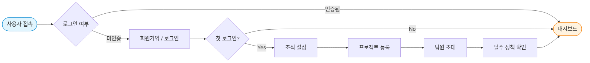
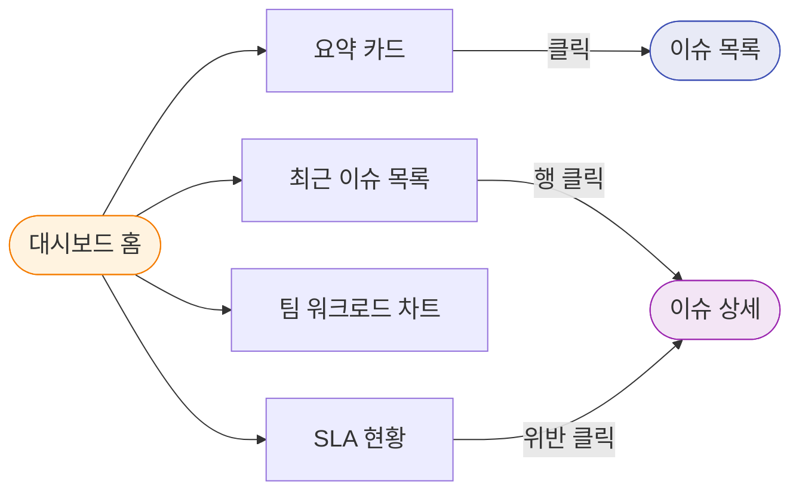
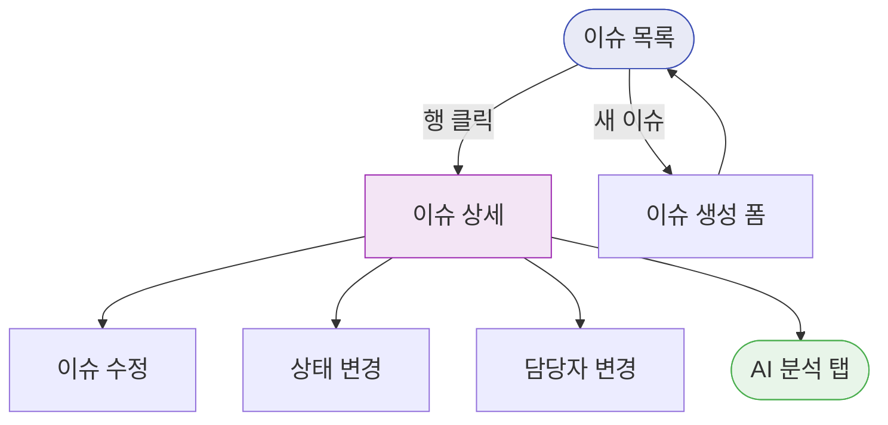
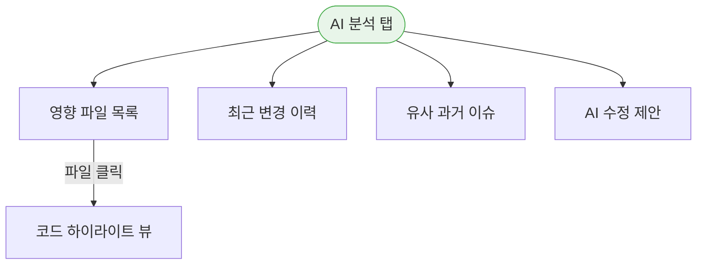
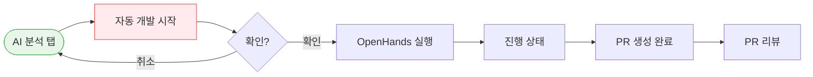
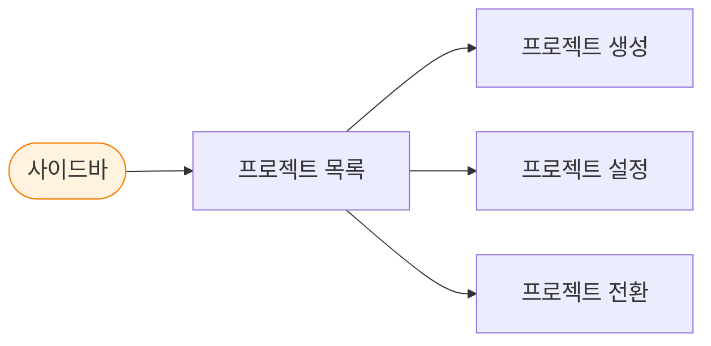

# IssueHub 사용자 플로우 (User Flow)

> Phase 0~4 전체 사용자 여정을 섹션별로 분리

---

## 1. 인증 + 온보딩

---

## 2. 대시보드

---

## 3. 이슈 관리

---

## 4. AI 코드 분석 (Phase 3)

---

## 5. 자동 개발 (Phase 3)

---

## 6. 프로젝트 관리 (Phase 1)

---

## 7. 커넥터 설정 (Phase 2)

---

## 8. 자동화 규칙 (Phase 2+)

---

## Phase별 기능 범위

```mermaid
%%{init: {'theme': 'default', 'themeVariables': {'fontSize': '20px', 'fontFamily': 'arial'}, 'flowchart': {'nodeSpacing': 30, 'rankSpacing': 50, 'padding': 15}}}%%
flowchart LR
    subgraph P0 [Phase 0: 기반]
        P0_1[스켈레톤 정리]
        P0_2[API 공통]
        P0_3[DB 마이그레이션]
        P0_4[개발 인프라]
        P0_5[UI 인프라]
    end

    subgraph P1 [Phase 1: 인증 + CRUD]
        P1_1[JWT 인증]
        P1_2[로그인 UI]
        P1_3[프로젝트 CRUD]
        P1_4[이슈 CRUD]
        P1_5[프론트 실데이터]
    end

    subgraph P2 [Phase 2: 연동 + 대시보드]
        P2_1[Jira 동기화]
        P2_2[커넥터 UI]
        P2_3[차트 + 트렌드]
        P2_4[프로젝트 스위처]
    end

    subgraph P3 [Phase 3: AI 코드 분석]
        P3_1[Git bare clone]
        P3_2[Ollama + LLM]
        P3_3[코드 인덱싱]
        P3_4[티켓 품질 분석]
        P3_5[AI 분석 UI]
    end

    subgraph P4 [Phase 4: 안정화]
        P4_1[테스트 보강]
        P4_2[모니터링]
        P4_3[배포 + 피드백]
    end

    P0 --> P1 --> P2 --> P3 --> P4
```

