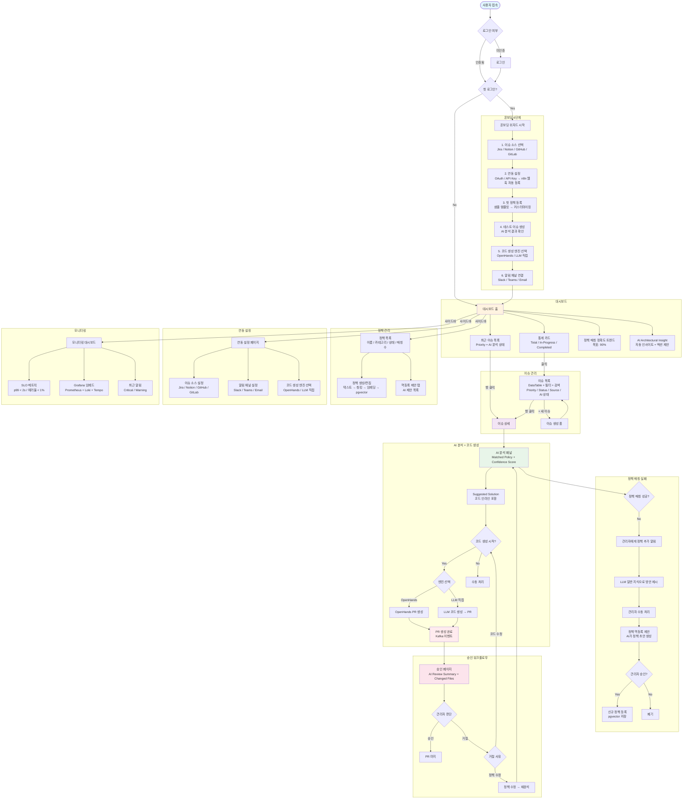

# IssueHub 사용자 플로우 (User Flow)

> MVP 기획서 기반 사용자 여정 플로우차트
> 최종 수정: 2026-04-09

## 전체 사용자 플로우

## Bounded Autonomy (자율/승인 경계)

| 상황 | AI 자율 수행 | 관리자 승인 필요 |
|------|-------------|----------------|
| 이슈 분석 + 정책 매칭 | ✅ | |
| 해결 방안 도출 | ✅ | |
| 코드 생성 (PR 생성) | ✅ | |
| PR 머지 | | ✅ 반드시 승인 |
| 정책 자동 수정/추가 | | ✅ 반드시 승인 |
| 외부 시스템 변경 | | ✅ 반드시 승인 |
