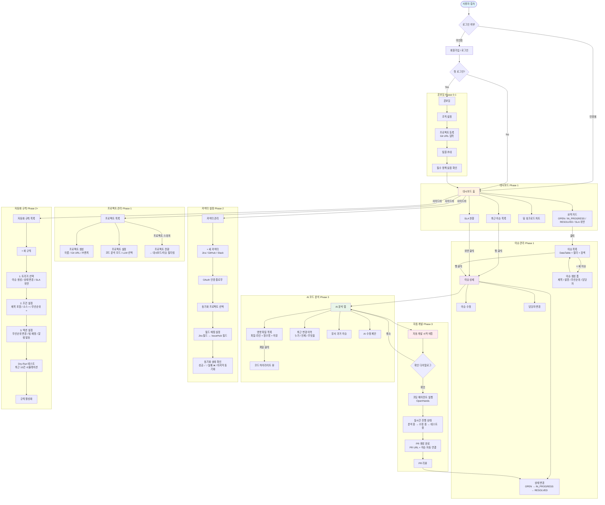

# IssueHub 사용자 플로우 (User Flow)

> Phase 0~4 전체 사용자 여정을 포괄하는 플로우차트

## 전체 사용자 플로우

```mermaid
flowchart TD
    START([사용자 접속]) --> LOGIN{로그인 여부}
    LOGIN -->|미인증| SIGNUP[회원가입 / 로그인]
    LOGIN -->|인증됨| DASHBOARD

    SIGNUP --> FIRST_LOGIN{첫 로그인?}
    FIRST_LOGIN -->|Yes| ONBOARD[온보딩]
    FIRST_LOGIN -->|No| DASHBOARD

    subgraph ONBOARDING [온보딩 Phase 0-1]
        ONBOARD --> SET_ORG[조직 설정]
        SET_ORG --> CREATE_PROJECT[프로젝트 등록\nGit URL 입력]
        CREATE_PROJECT --> INVITE_MEMBER[팀원 초대]
        INVITE_MEMBER --> READ_POLICY[필수 정책 읽음 확인]
    end

    READ_POLICY --> DASHBOARD

    subgraph DASH [대시보드 Phase 1]
        DASHBOARD[대시보드 홈]
        DASHBOARD --> SUMMARY[요약 카드\nOPEN / IN_PROGRESS / RESOLVED / SLA 위반]
        DASHBOARD --> RECENT[최근 이슈 목록]
        DASHBOARD --> WORKLOAD[팀 워크로드 차트]
        DASHBOARD --> SLA_STATUS[SLA 현황]
    end

    SUMMARY -->|클릭| ISSUE_LIST
    RECENT -->|행 클릭| ISSUE_DETAIL
    SLA_STATUS -->|위반 클릭| ISSUE_DETAIL

    subgraph ISSUES [이슈 관리 Phase 1]
        ISSUE_LIST[이슈 목록\nDataTable + 필터 + 검색]
        ISSUE_LIST -->|행 클릭| ISSUE_DETAIL[이슈 상세]
        ISSUE_LIST -->|+ 새 이슈| ISSUE_CREATE[이슈 생성 폼\n제목 / 설명 / 우선순위 / 담당자]
        ISSUE_CREATE --> ISSUE_LIST

        ISSUE_DETAIL --> EDIT_ISSUE[이슈 수정]
        ISSUE_DETAIL --> STATUS_CHANGE[상태 변경\nOPEN → IN_PROGRESS → RESOLVED]
        ISSUE_DETAIL --> ASSIGN[담당자 변경]
    end

    subgraph AI_ANALYSIS [AI 코드 분석 Phase 3]
        ISSUE_DETAIL --> AI_TAB[AI 분석 탭]
        AI_TAB --> AFFECTED_FILES[영향 파일 목록\n파일:라인 + 함수명 + 이유]
        AI_TAB --> CHANGE_HISTORY[최근 변경 이력\n누가 / 언제 / 무엇을]
        AI_TAB --> SIMILAR_ISSUES[유사 과거 이슈]
        AI_TAB --> FIX_SUGGEST[AI 수정 제안]
        AFFECTED_FILES -->|파일 클릭| CODE_VIEW[코드 하이라이트 뷰]
    end

    subgraph AUTO_DEV [자동 개발 Phase 3]
        AI_TAB --> AUTO_DEV_BTN[자동 개발 시작 버튼]
        AUTO_DEV_BTN --> CONFIRM_DIALOG{확인 다이얼로그}
        CONFIRM_DIALOG -->|확인| AGENT_RUN[코딩 에이전트 실행\nOpenHands]
        CONFIRM_DIALOG -->|취소| AI_TAB
        AGENT_RUN --> PROGRESS[실시간 진행 상태\n분석 중 → 수정 중 → 테스트 중]
        PROGRESS --> PR_CREATED[PR 생성 완료\nPR URL + 이슈 자동 연결]
        PR_CREATED --> REVIEW_PR[PR 리뷰]
        REVIEW_PR --> STATUS_CHANGE
    end

    subgraph PROJECT_MGMT [프로젝트 관리 Phase 1]
        DASHBOARD -->|사이드바| PROJECT_LIST[프로젝트 목록]
        PROJECT_LIST --> PROJECT_CREATE[프로젝트 생성\n이름 / Git URL / 브랜치]
        PROJECT_LIST --> PROJECT_SETTINGS[프로젝트 설정\n코드 분석 모드 / LLM 선택]
        PROJECT_LIST -->|프로젝트 스위처| SWITCH_PROJECT[프로젝트 전환\n→ 대시보드/이슈 필터링]
    end

    subgraph CONNECTOR [커넥터 설정 Phase 2]
        DASHBOARD -->|사이드바| CONNECTOR_LIST[커넥터 관리]
        CONNECTOR_LIST --> ADD_CONNECTOR[+ 새 커넥터\nJira / GitHub / Slack]
        ADD_CONNECTOR --> OAUTH[OAuth 인증 플로우]
        OAUTH --> SELECT_PROJECT_SYNC[동기화 프로젝트 선택]
        SELECT_PROJECT_SYNC --> FIELD_MAPPING[필드 매핑 설정\nJira 필드 ↔ IssueHub 필드]
        FIELD_MAPPING --> SYNC_STATUS[동기화 상태 확인\n성공 ✅ / 실패 ❌ / 마지막 동기화]
    end

    subgraph AUTOMATION [자동화 규칙 Phase 2+]
        DASHBOARD -->|사이드바| RULE_LIST[자동화 규칙 목록]
        RULE_LIST --> CREATE_RULE[+ 새 규칙]
        CREATE_RULE --> TRIGGER[1. 트리거 선택\n이슈 생성 / 상태 변경 / SLA 위반]
        TRIGGER --> CONDITION[2. 조건 설정\n제목 포함 / 소스 = / 우선순위 =]
        CONDITION --> ACTION[3. 액션 설정\n우선순위 변경 / 팀 배정 / 알림 발송]
        ACTION --> DRY_RUN[Dry-Run 테스트\n최근 10건 시뮬레이션]
        DRY_RUN --> ACTIVATE[규칙 활성화]
    end

    style START fill:#e1f5fe
    style DASHBOARD fill:#fff3e0
    style ISSUE_DETAIL fill:#f3e5f5
    style AI_TAB fill:#e8f5e9
    style AUTO_DEV_BTN fill:#ffebee
```

## Phase별 기능 범위

```mermaid
flowchart LR
    subgraph P0 [Phase 0: 기반]
        P0_1[스켈레톤 정리]
        P0_2[API 공통]
        P0_3[DB 마이그레이션]
        P0_4[개발 인프라]
        P0_5[UI 인프라]
    end

    subgraph P1 [Phase 1: 인증 + CRUD]
        P1_1[JWT 인증]
        P1_2[로그인 UI]
        P1_3[프로젝트 CRUD]
        P1_4[이슈 CRUD]
        P1_5[프론트 실데이터]
    end

    subgraph P2 [Phase 2: 연동 + 대시보드]
        P2_1[Jira 동기화]
        P2_2[커넥터 UI]
        P2_3[차트 + 트렌드]
        P2_4[프로젝트 스위처]
    end

    subgraph P3 [Phase 3: AI 코드 분석]
        P3_1[Git bare clone]
        P3_2[Ollama + LLM]
        P3_3[코드 인덱싱]
        P3_4[티켓 품질 분석]
        P3_5[AI 분석 UI]
    end

    subgraph P4 [Phase 4: 안정화]
        P4_1[테스트 보강]
        P4_2[모니터링]
        P4_3[배포 + 피드백]
    end

    P0 --> P1 --> P2 --> P3 --> P4
```
