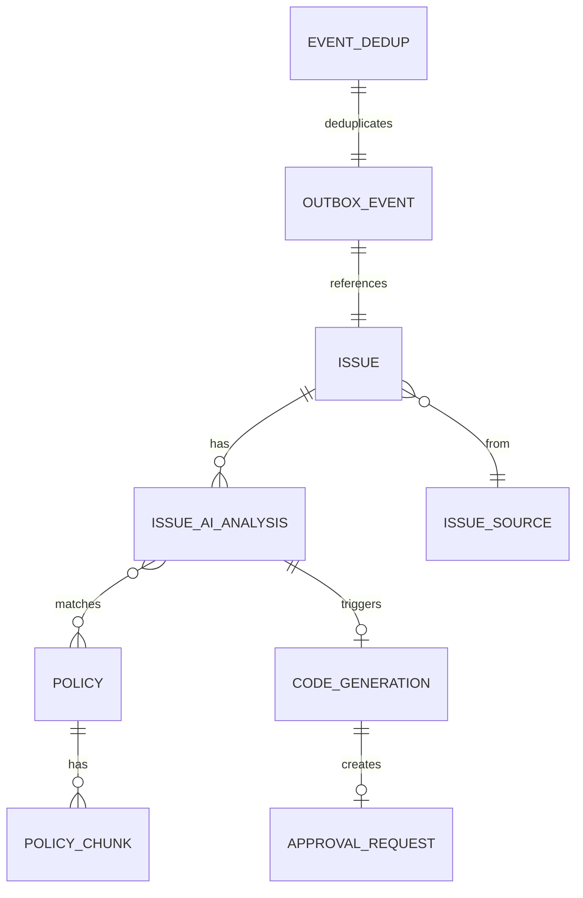

# IssueHub MVP 기술 설계서

> 문서 버전: 1.0
> 최종 수정: 2026-04-09
> 참조: [MVP 기획서](issuehub-mvp-기획서.md) | [화면 설계서](issuehub-mvp-화면설계.md)

---

## 1. 시스템 아키텍처

### 1.1 기술 스택

| 영역 | 기술 | 버전 | 비고 |
|------|------|------|------|
| Backend | Kotlin + Spring Boot | 3.x | Hexagonal Architecture |
| Frontend | Next.js + TypeScript + shadcn/ui | 16.x | App Router, Tailwind CSS |
| DB | PostgreSQL + pgvector | 16 + 0.7+ | HNSW 인덱스, 벡터 검색 + RDB |
| Cache | Redis | 7.x | 세션, 캐시 |
| Message Broker | Apache Kafka | 3.x | 이벤트 드리븐, Outbox 패턴, DLT |
| AI/RAG | Spring AI | 1.0+ | Ollama(기본) + Claude API(폴백) |
| Code Generation | OpenHands / LLM 직접 호출 | latest | outbound port 추상화 |
| 연동 허브 | n8n | latest | 이슈 소스 + 알림 채널 게이트웨이 |
| Observability | Prometheus + Grafana + Loki + Tempo | latest | OTel Collector, Alertmanager |
| 인프라 메트릭 | Node Exporter + cAdvisor | latest | 호스트/컨테이너 |
| 인프라 | Docker Compose | latest | 로컬, 리소스 limit 적용 |

### 1.2 모듈 구조

```
backend/
├── core-domain/          # 순수 도메인 모델 (의존성 없음)
│   ├── model/            # Issue, Policy, User, ApprovalRequest
│   ├── enums/            # IssueStatus, IssuePriority, PolicyStatus, ApprovalStatus
│   └── exception/        # DomainException sealed class
│
├── core-issue/           # 이슈 도메인
│   ├── port/inbound/     # CreateIssueUseCase, AnalyzeIssueUseCase
│   ├── port/outbound/    # LoadIssuePort, SaveIssuePort
│   ├── service/          # IssueService
│   └── event/            # IssueCreatedEvent, IssueUpdatedEvent
│
├── core-policy/          # 정책 도메인
│   ├── port/inbound/     # CreatePolicyUseCase, SearchPolicyUseCase
│   ├── port/outbound/    # LoadPolicyPort, SavePolicyPort, EmbedPolicyPort
│   ├── service/          # PolicyService
│   └── event/            # PolicyCreatedEvent
│
├── core-ai/              # AI 분석 도메인
│   ├── port/inbound/     # AnalyzeIssueUseCase, GenerateCodeUseCase
│   ├── port/outbound/    # PolicyRagPort, CodeGenerationPort, LlmPort
│   └── service/          # AiAnalysisService
│
├── core-automation/      # 자동화 엔진
│   ├── port/inbound/     # ProcessIssueEventUseCase, ApproveRequestUseCase
│   ├── port/outbound/    # NotificationPort
│   └── service/          # AutomationService, ApprovalService
│
├── infra-persistence/    # JPA + pgvector 어댑터
│   ├── adapter/          # IssuePersistenceAdapter, PolicyPersistenceAdapter
│   ├── entity/           # IssueJpaEntity, PolicyJpaEntity, OutboxJpaEntity
│   └── repository/       # IssueJpaRepository, PolicyJpaRepository, OutboxJpaRepository
│
├── infra-kafka/          # Kafka 어댑터
│   ├── publisher/        # OutboxPublisher (Polling/CDC)
│   ├── consumer/         # IssueEventConsumer, CodeGenEventConsumer
│   └── config/           # KafkaConfig, TopicConfig
│
├── infra-llm/            # LLM 어댑터
│   ├── adapter/          # OllamaAdapter, ClaudeAdapter
│   └── config/           # LlmConfig, SpringAiConfig
│
├── infra-codegen/        # 코드 생성 어댑터
│   ├── adapter/          # OpenHandsAdapter, LlmDirectCodeGenAdapter
│   └── config/           # CodeGenConfig
│
├── infra-webhook/        # Webhook 수신 어댑터
│   ├── adapter/          # N8nWebhookAdapter
│   └── config/           # WebhookConfig
│
└── app-api/              # REST API 진입점
    ├── controller/       # IssueController, PolicyController, ApprovalController, ...
    ├── dto/              # Request/Response DTO
    └── config/           # SecurityConfig, CorsConfig, ActuatorConfig
```

### 1.3 의존성 방향

```
app-api → infra-* → core-* → core-domain
                      ↑
           core-domain은 어떤 모듈도 의존하지 않음
           core-*는 다른 core-*를 의존 가능, infra-* 의존 금지
           infra-*끼리 서로 의존 금지
```

### 1.4 아키텍처 다이어그램

```
                    ┌─────────────────────────────────────────┐
                    │            Docker Compose                │
┌──────────┐       │  ┌─────────────────────────────────────┐ │
│  n8n     │──────►│  │         app-api (Spring Boot)        │ │
│ (연동허브)│◄──────│  │  ┌────────────────────────────────┐  │ │
└──────────┘       │  │  │ Controller (REST Inbound)      │  │ │
                    │  │  └──────────┬─────────────────────┘  │ │
┌──────────┐       │  │             │                         │ │
│ Next.js  │──────►│  │  ┌──────────▼─────────────────────┐  │ │
│(Frontend)│       │  │  │ core-issue  core-policy  core-ai│  │ │
└──────────┘       │  │  │ core-automation                 │  │ │
                    │  │  │ (UseCase → Service → Port)     │  │ │
                    │  │  └──────────┬─────────────────────┘  │ │
                    │  │             │                         │ │
                    │  │  ┌──────────▼─────────────────────┐  │ │
                    │  │  │ infra-persistence (pgvector)    │  │ │
                    │  │  │ infra-kafka (Outbox→Kafka)     │  │ │
                    │  │  │ infra-llm (Ollama/Claude)      │  │ │
                    │  │  │ infra-codegen (OpenHands/LLM)  │  │ │
                    │  │  │ infra-webhook (n8n)            │  │ │
                    │  │  └────────────────────────────────┘  │ │
                    │  └─────────────────────────────────────┘ │
                    │                                           │
                    │  ┌──────────┐ ┌──────────┐ ┌──────────┐ │
                    │  │PostgreSQL│ │  Redis   │ │  Kafka   │ │
                    │  │+pgvector │ │          │ │+Zookeeper│ │
                    │  └──────────┘ └──────────┘ └──────────┘ │
                    │                                           │
                    │  ┌──────────┐ ┌──────────┐               │
                    │  │  Ollama  │ │OpenHands │               │
                    │  └──────────┘ └──────────┘               │
                    │                                           │
                    │  ┌──────────────────────────────────────┐│
                    │  │ OTel → Prometheus/Loki/Tempo → Grafana││
                    │  └──────────────────────────────────────┘│
                    └─────────────────────────────────────────┘
```

---

## 2. DB 스키마

### 2.1 ERD 개요



### 2.2 테이블 정의

#### issues

```sql
CREATE TABLE issues (
    id              UUID PRIMARY KEY DEFAULT gen_random_uuid(),
    title           VARCHAR(500) NOT NULL,
    description     TEXT,
    priority        VARCHAR(20) NOT NULL DEFAULT 'MEDIUM',  -- LOW, MEDIUM, HIGH, CRITICAL
    status          VARCHAR(20) NOT NULL DEFAULT 'OPEN',    -- OPEN, IN_PROGRESS, TRIAGED, RESOLVED, CLOSED
    source          VARCHAR(20) NOT NULL DEFAULT 'INTERNAL', -- INTERNAL, JIRA, GITHUB, NOTION, GITLAB
    source_id       VARCHAR(255),                            -- 외부 시스템 ID (JIRA-1234 등)
    source_url      VARCHAR(1000),                           -- 외부 시스템 URL
    assignee_id     UUID REFERENCES users(id),
    component       VARCHAR(100),
    metadata        JSONB DEFAULT '{}',                      -- 소스별 추가 데이터
    created_at      TIMESTAMPTZ NOT NULL DEFAULT NOW(),
    updated_at      TIMESTAMPTZ NOT NULL DEFAULT NOW(),
    webhook_id      VARCHAR(255) UNIQUE                      -- 멱등성 보장
);

CREATE INDEX idx_issues_status ON issues(status);
CREATE INDEX idx_issues_priority ON issues(priority);
CREATE INDEX idx_issues_source ON issues(source);
CREATE INDEX idx_issues_created_at ON issues(created_at DESC);
```

#### policies

```sql
CREATE TABLE policies (
    id              UUID PRIMARY KEY DEFAULT gen_random_uuid(),
    name            VARCHAR(300) NOT NULL,
    category        VARCHAR(100) NOT NULL,                   -- INFRA, SECURITY, COMPLIANCE, PERFORMANCE, etc.
    description     TEXT NOT NULL,
    status          VARCHAR(20) NOT NULL DEFAULT 'DRAFT',    -- DRAFT, ACTIVE, ARCHIVED
    match_count     INTEGER NOT NULL DEFAULT 0,
    created_by      UUID REFERENCES users(id),
    created_at      TIMESTAMPTZ NOT NULL DEFAULT NOW(),
    updated_at      TIMESTAMPTZ NOT NULL DEFAULT NOW()
);

CREATE INDEX idx_policies_status ON policies(status);
CREATE INDEX idx_policies_category ON policies(category);
```

#### policy_chunks (pgvector)

```sql
CREATE TABLE policy_chunks (
    id              UUID PRIMARY KEY DEFAULT gen_random_uuid(),
    policy_id       UUID NOT NULL REFERENCES policies(id) ON DELETE CASCADE,
    chunk_index     INTEGER NOT NULL,                        -- 청크 순서
    content         TEXT NOT NULL,                            -- 청크 텍스트
    embedding       vector(1536),                            -- 임베딩 벡터
    created_at      TIMESTAMPTZ NOT NULL DEFAULT NOW()
);

-- 초기 데이터 적재 후 HNSW 인덱스 생성 (빈 테이블에 생성 금지)
-- CREATE INDEX idx_policy_chunks_embedding ON policy_chunks
--     USING hnsw (embedding vector_cosine_ops) WITH (m = 16, ef_construction = 64);

CREATE INDEX idx_policy_chunks_policy_id ON policy_chunks(policy_id);
```

#### issue_ai_analyses

```sql
CREATE TABLE issue_ai_analyses (
    id              UUID PRIMARY KEY DEFAULT gen_random_uuid(),
    issue_id        UUID NOT NULL REFERENCES issues(id) ON DELETE CASCADE,
    matched_policy_id UUID REFERENCES policies(id),
    confidence_score  DECIMAL(5,2),                          -- 0.00 ~ 100.00
    suggested_solution TEXT,
    analysis_status   VARCHAR(20) NOT NULL DEFAULT 'PENDING', -- PENDING, ANALYZING, COMPLETED, FAILED, NO_POLICY
    fallback_used     BOOLEAN NOT NULL DEFAULT FALSE,         -- LLM 일반 지식 사용 여부
    raw_response      JSONB,                                  -- LLM 원본 응답
    created_at        TIMESTAMPTZ NOT NULL DEFAULT NOW(),
    updated_at        TIMESTAMPTZ NOT NULL DEFAULT NOW()
);

CREATE UNIQUE INDEX idx_ai_analyses_issue_id ON issue_ai_analyses(issue_id);
CREATE INDEX idx_ai_analyses_status ON issue_ai_analyses(analysis_status);
```

#### code_generations

```sql
CREATE TABLE code_generations (
    id              UUID PRIMARY KEY DEFAULT gen_random_uuid(),
    issue_id        UUID NOT NULL REFERENCES issues(id),
    analysis_id     UUID NOT NULL REFERENCES issue_ai_analyses(id),
    engine          VARCHAR(20) NOT NULL,                    -- OPENHANDS, LLM_DIRECT
    status          VARCHAR(20) NOT NULL DEFAULT 'PENDING',  -- PENDING, IN_PROGRESS, COMPLETED, FAILED, TIMEOUT
    pr_url          VARCHAR(1000),
    pr_number       INTEGER,
    changed_files   INTEGER,
    additions       INTEGER,
    deletions       INTEGER,
    error_message   TEXT,
    started_at      TIMESTAMPTZ,
    completed_at    TIMESTAMPTZ,
    created_at      TIMESTAMPTZ NOT NULL DEFAULT NOW()
);

CREATE INDEX idx_code_generations_issue_id ON code_generations(issue_id);
CREATE INDEX idx_code_generations_status ON code_generations(status);
```

#### approval_requests

```sql
CREATE TABLE approval_requests (
    id              UUID PRIMARY KEY DEFAULT gen_random_uuid(),
    code_generation_id UUID NOT NULL REFERENCES code_generations(id),
    issue_id        UUID NOT NULL REFERENCES issues(id),
    status          VARCHAR(20) NOT NULL DEFAULT 'PENDING',  -- PENDING, APPROVED, REJECTED
    ai_review_summary TEXT,
    reviewer_id     UUID REFERENCES users(id),
    feedback        TEXT,                                     -- 거절 시 피드백
    reject_reason   VARCHAR(30),                              -- CODE_FIX, POLICY_FIX
    reviewed_at     TIMESTAMPTZ,
    created_at      TIMESTAMPTZ NOT NULL DEFAULT NOW()
);

CREATE INDEX idx_approval_requests_status ON approval_requests(status);
CREATE INDEX idx_approval_requests_issue_id ON approval_requests(issue_id);
```

#### policy_suggestions (정책 역등록 제안)

```sql
CREATE TABLE policy_suggestions (
    id              UUID PRIMARY KEY DEFAULT gen_random_uuid(),
    issue_id        UUID NOT NULL REFERENCES issues(id),
    suggested_name  VARCHAR(300) NOT NULL,
    suggested_category VARCHAR(100),
    suggested_content TEXT NOT NULL,                          -- AI 생성 정책 초안
    status          VARCHAR(20) NOT NULL DEFAULT 'PENDING',  -- PENDING, APPROVED, REJECTED
    approved_policy_id UUID REFERENCES policies(id),          -- 승인 시 생성된 정책
    created_at      TIMESTAMPTZ NOT NULL DEFAULT NOW()
);
```

#### outbox_events (Transactional Outbox)

```sql
CREATE TABLE outbox_events (
    id              UUID PRIMARY KEY DEFAULT gen_random_uuid(),
    aggregate_type  VARCHAR(50) NOT NULL,                    -- ISSUE, POLICY, CODE_GENERATION
    aggregate_id    UUID NOT NULL,
    event_type      VARCHAR(100) NOT NULL,                   -- IssueCreated, AnalysisCompleted, etc.
    payload         JSONB NOT NULL,
    published       BOOLEAN NOT NULL DEFAULT FALSE,
    created_at      TIMESTAMPTZ NOT NULL DEFAULT NOW()
);

CREATE INDEX idx_outbox_unpublished ON outbox_events(published, created_at) WHERE published = FALSE;
```

#### event_dedup (Consumer 멱등성)

```sql
CREATE TABLE event_dedup (
    event_id        UUID PRIMARY KEY,                        -- Kafka message key
    processed_at    TIMESTAMPTZ NOT NULL DEFAULT NOW()
);

-- UNIQUE constraint + ON CONFLICT DO NOTHING으로 race condition 방지
```

#### users

```sql
CREATE TABLE users (
    id              UUID PRIMARY KEY DEFAULT gen_random_uuid(),
    email           VARCHAR(255) NOT NULL UNIQUE,
    name            VARCHAR(100) NOT NULL,
    role            VARCHAR(20) NOT NULL DEFAULT 'MEMBER',   -- ADMIN, MEMBER
    avatar_url      VARCHAR(500),
    created_at      TIMESTAMPTZ NOT NULL DEFAULT NOW()
);
```

#### integrations (연동 설정)

```sql
CREATE TABLE integrations (
    id              UUID PRIMARY KEY DEFAULT gen_random_uuid(),
    type            VARCHAR(20) NOT NULL,                    -- JIRA, NOTION, GITHUB, GITLAB, SLACK, TEAMS, EMAIL
    role            VARCHAR(20) NOT NULL,                    -- ISSUE_SOURCE, NOTIFICATION
    status          VARCHAR(20) NOT NULL DEFAULT 'DISCONNECTED', -- CONNECTED, DISCONNECTED, ERROR
    config          JSONB NOT NULL DEFAULT '{}',             -- API Key, webhook URL, OAuth 토큰 등 (암호화)
    n8n_workflow_id VARCHAR(100),                             -- n8n 워크플로우 ID
    last_sync_at    TIMESTAMPTZ,
    created_at      TIMESTAMPTZ NOT NULL DEFAULT NOW(),
    updated_at      TIMESTAMPTZ NOT NULL DEFAULT NOW()
);
```

---

## 3. API 스펙

### 3.1 기본 정보

| 항목 | 값 |
|------|-----|
| Base URL | `http://localhost:8080/api/v1` |
| Content-Type | `application/json` |
| 인증 | Bearer Token (JWT) — MVP에서는 간소화 |

### 3.2 공통 응답 포맷

```json
// 성공 (단건)
{ "success": true, "data": { ... }, "timestamp": "2026-04-09T10:00:00Z" }

// 성공 (목록)
{ "success": true, "data": [...], "page": { "number": 0, "size": 20, "totalElements": 150, "totalPages": 8 }, "timestamp": "..." }

// 에러
{ "success": false, "error": { "code": "ISSUE_NOT_FOUND", "message": "...", "details": null }, "timestamp": "..." }
```

### 3.3 이슈 API

| Method | Path | 설명 |
|--------|------|------|
| GET | `/issues` | 이슈 목록 (필터: priority, status, source, page, size) |
| GET | `/issues/{id}` | 이슈 상세 |
| POST | `/issues` | 이슈 생성 → Kafka 이벤트 → AI 분석 자동 시작 |
| PUT | `/issues/{id}` | 이슈 수정 |
| DELETE | `/issues/{id}` | 이슈 삭제 |
| GET | `/issues/{id}/analysis` | AI 분석 결과 조회 |
| POST | `/issues/{id}/analysis/retry` | AI 분석 재시도 |
| POST | `/issues/{id}/code-generation` | 코드 생성 요청 (engine: OPENHANDS / LLM_DIRECT) |

#### POST /issues 요청

```json
{
  "title": "로그인 시 500 에러 발생",
  "description": "프로덕션 환경에서 로그인 시 500 에러가 간헐적으로 발생",
  "priority": "HIGH",
  "component": "Backend/Auth"
}
```

#### GET /issues/{id}/analysis 응답

```json
{
  "success": true,
  "data": {
    "id": "uuid",
    "issueId": "uuid",
    "matchedPolicy": {
      "id": "uuid",
      "name": "Performance Optimization v2.1",
      "category": "Infrastructure"
    },
    "confidenceScore": 94.0,
    "suggestedSolution": "Implement a composite index on user_id and timestamp...",
    "analysisStatus": "COMPLETED",
    "fallbackUsed": false
  }
}
```

### 3.4 정책 API

| Method | Path | 설명 |
|--------|------|------|
| GET | `/policies` | 정책 목록 (필터: category, status) |
| GET | `/policies/{id}` | 정책 상세 |
| POST | `/policies` | 정책 생성 → 자동 청킹 + 임베딩 + pgvector 저장 |
| PUT | `/policies/{id}` | 정책 수정 → 재임베딩 |
| DELETE | `/policies/{id}` | 정책 삭제 |
| GET | `/policies/suggestions` | 역등록 제안 목록 |
| POST | `/policies/suggestions/{id}/approve` | 제안 승인 → 정책 생성 |
| POST | `/policies/suggestions/{id}/reject` | 제안 거절 |

#### POST /policies 요청

```json
{
  "name": "Redis 장애 대응 정책",
  "category": "INFRA",
  "description": "Redis 연결 실패 시 서킷브레이커 패턴을 적용하고, 자동 재연결 로직을 구현해야 한다. 연결 풀 크기는 최소 10, 최대 50으로 설정하며, 타임아웃은 3초로 지정한다."
}
```

### 3.5 승인 API

| Method | Path | 설명 |
|--------|------|------|
| GET | `/approvals` | 승인 요청 목록 (필터: status) |
| GET | `/approvals/{id}` | 승인 요청 상세 (AI Review Summary 포함) |
| POST | `/approvals/{id}/approve` | 승인 → PR 머지 |
| POST | `/approvals/{id}/reject` | 거절 + 피드백 |

#### POST /approvals/{id}/reject 요청

```json
{
  "rejectReason": "CODE_FIX",
  "feedback": "인덱스 생성 시 CONCURRENTLY 옵션이 필요합니다"
}
```

### 3.6 연동 API

| Method | Path | 설명 |
|--------|------|------|
| GET | `/integrations` | 연동 목록 |
| POST | `/integrations` | 연동 추가 (type, role, config) |
| PUT | `/integrations/{id}` | 연동 수정 |
| DELETE | `/integrations/{id}` | 연동 해제 |
| POST | `/integrations/{id}/test` | 연결 테스트 |

### 3.7 대시보드 API

| Method | Path | 설명 |
|--------|------|------|
| GET | `/dashboard/stats` | 통계 (total, in-progress, completed, 증감) |
| GET | `/dashboard/recent-issues` | 최근 이슈 (priority + AI 상태 포함) |
| GET | `/dashboard/policy-accuracy` | 정책 매칭 정확도 트렌드 |
| GET | `/dashboard/insights` | AI Architectural Insight |

### 3.8 모니터링 API

| Method | Path | 설명 |
|--------|------|------|
| GET | `/monitoring/slo` | SLO 메트릭 (p99, 에러율, 파이프라인 상태) |
| GET | `/monitoring/alerts` | 최근 알림 목록 |

### 3.9 Webhook API (n8n → IssueHub)

| Method | Path | 설명 |
|--------|------|------|
| POST | `/webhooks/issues` | 외부 이슈 수신 (멱등성: X-Webhook-Id 헤더) |

#### POST /webhooks/issues 요청

```json
{
  "source": "JIRA",
  "sourceId": "JIRA-1234",
  "sourceUrl": "https://company.atlassian.net/browse/JIRA-1234",
  "title": "로그인 500 에러",
  "description": "...",
  "priority": "HIGH",
  "metadata": {
    "jiraProject": "PAY",
    "jiraIssueType": "Bug"
  }
}
```

---

## 4. Kafka 토픽 설계

| 토픽 | 파티션 키 | 용도 |
|------|----------|------|
| `issuehub.issue.created` | issue_id | 이슈 생성 → AI 분석 트리거 |
| `issuehub.issue.updated` | issue_id | 이슈 수정 이벤트 |
| `issuehub.analysis.completed` | issue_id | AI 분석 완료 → 코드 생성 판단 |
| `issuehub.codegen.requested` | issue_id | 코드 생성 요청 → OpenHands/LLM |
| `issuehub.codegen.completed` | issue_id | PR 생성 완료 → 승인 요청 |
| `issuehub.dlt` | - | Dead Letter Topic (실패 이벤트) |

### 이벤트 페이로드 예시

```json
// issuehub.issue.created
{
  "eventId": "uuid",
  "eventType": "IssueCreated",
  "aggregateId": "issue-uuid",
  "timestamp": "2026-04-09T10:00:00Z",
  "data": {
    "issueId": "uuid",
    "title": "로그인 500 에러",
    "priority": "HIGH",
    "source": "JIRA"
  }
}
```

---

## 5. 인프라 구성 (Docker Compose)

```yaml
# docker-compose.yml 주요 서비스
services:
  issuehub-backend:
    image: issuehub-backend:latest
    mem_limit: 1g
    environment:
      - SPRING_PROFILES_ACTIVE=local
      - OTEL_EXPORTER_OTLP_ENDPOINT=http://otel-collector:4317

  issuehub-frontend:
    image: issuehub-frontend:latest
    mem_limit: 512m
    ports: ["3000:3000"]

  postgresql:
    image: pgvector/pgvector:pg16
    mem_limit: 1g
    volumes: ["pgdata:/var/lib/postgresql/data"]

  redis:
    image: redis:7-alpine
    mem_limit: 256m

  kafka:
    image: confluentinc/cp-kafka:7.6.0
    mem_limit: 1g
  zookeeper:
    image: confluentinc/cp-zookeeper:7.6.0
    mem_limit: 512m

  n8n:
    image: n8nio/n8n:latest
    mem_limit: 512m
    ports: ["5678:5678"]

  ollama:
    image: ollama/ollama:latest
    mem_limit: 4g  # LLM 모델 로딩에 필요
    volumes: ["ollama_models:/root/.ollama"]

  # docker-compose.override.yml로 선택적 기동
  openhands:
    image: ghcr.io/all-hands-ai/openhands:latest
    mem_limit: 4g
    profiles: ["codegen"]

  # Observability
  otel-collector:
    image: otel/opentelemetry-collector-contrib:latest
    mem_limit: 256m
  prometheus:
    image: prom/prometheus:latest
    mem_limit: 512m
  alertmanager:
    image: prom/alertmanager:latest
    mem_limit: 128m
  grafana:
    image: grafana/grafana:latest
    mem_limit: 256m
    ports: ["3001:3000"]
  loki:
    image: grafana/loki:latest
    mem_limit: 256m
  tempo:
    image: grafana/tempo:latest
    mem_limit: 256m
  node-exporter:
    image: prom/node-exporter:latest
  cadvisor:
    image: gcr.io/cadvisor/cadvisor:latest
```

### 최소 사양

- **RAM**: 16GB 이상 (Ollama 4GB + OpenHands 4GB + 나머지 8GB)
- **CPU**: 4코어 이상
- **Disk**: 20GB 이상 (LLM 모델 + Docker 이미지)

---

## 6. 보안 설계

| 항목 | 구현 |
|------|------|
| 인증 | JWT (Spring Security) — MVP 간소화 |
| Webhook 검증 | HMAC signature (X-Webhook-Signature) |
| 시크릿 관리 | `.env` 파일 + `.gitignore` 등록 |
| API Key 암호화 | integrations.config JSONB 내 AES 암호화 |
| CORS | app-api CorsConfig에서 프론트엔드 도메인만 허용 |

---

## 7. 테스트 전략

| 유형 | 위치 | 도구 | 대상 |
|------|------|------|------|
| 단위 테스트 | core-*/src/test/ | JUnit 5 + MockK | Service, Domain Model |
| 통합 테스트 | infra-*/src/test/ | @SpringBootTest + Testcontainers | Adapter, Repository, pgvector |
| 아키텍처 테스트 | app-api/src/test/ | ArchUnit | 의존성 방향 검증 |
| API 테스트 | app-api/src/test/ | MockMvc | Controller |
| E2E 테스트 | frontend/ | Playwright | 화면 플로우 |

### 아키텍처 테스트 필수 규칙

```kotlin
// core-domain은 어떤 모듈도 의존하지 않는다
// core-*는 infra-*를 의존하지 않는다
// infra-*끼리 서로 의존하지 않는다
```
