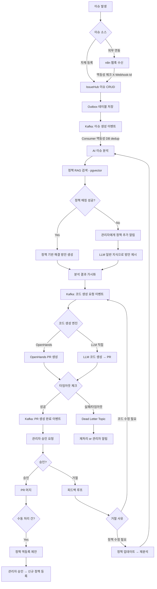
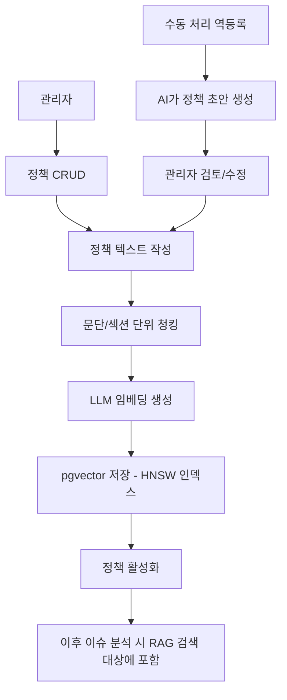
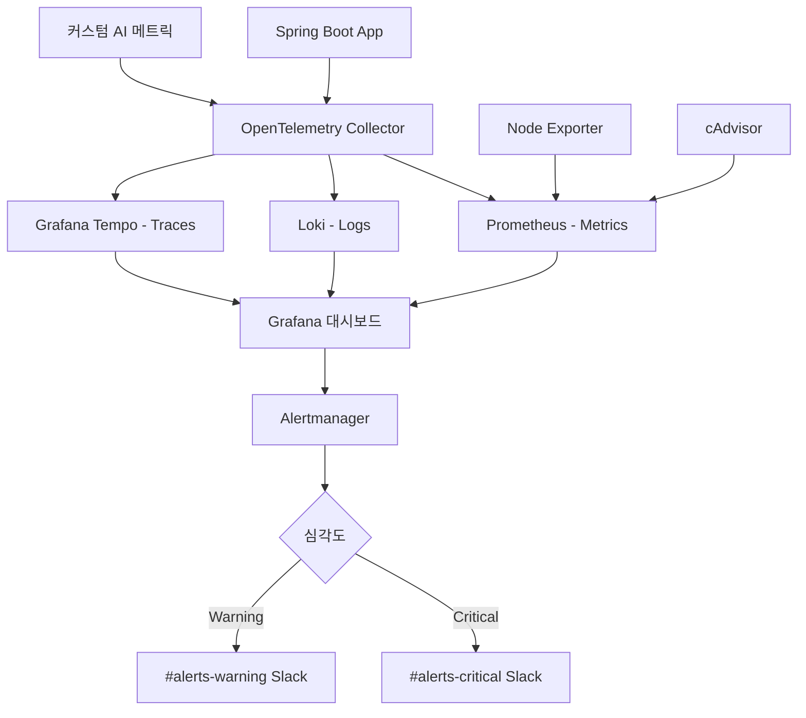

# IssueHub MVP 기획서

## 1. 서비스 개요

- **한 문장 설명**: 이슈를 분석하고, 서비스 운영 정책(벡터DB+RAG) 기반으로 자동 개발(PR 생성)까지 수행하는 AI 플랫폼
- **타겟 사용자**: 내부 개발팀 (1차) → B2B SaaS (확장)
- **핵심 가치**: 조직의 서비스 운영 정책을 학습한 AI가 이슈를 분석하고, 정책에 맞는 코드를 자동 생성하여 개발 생산성을 극대화한다

### 핵심 플로우

```
이슈 등록/수신 → AI 이슈 분석 → 정책 RAG 매칭 → 해결 방안 도출 → 코드 생성(PR) → 관리자 승인 → 머지
```

### 정책 매칭 실패 시

```
정책 매칭 실패 → 관리자에게 "정책 추가 필요" 알림
               + LLM 일반 지식으로 해결 방안 제시
               → 관리자 수동 처리 후 → 해당 케이스를 정책으로 역등록 (피드백 루프)
```

### Bounded Autonomy (자율/승인 경계)

| 상황 | AI 자율 수행 | 관리자 승인 필요 |
|------|-------------|----------------|
| 이슈 분석 + 정책 매칭 | ✅ | |
| 해결 방안 도출 | ✅ | |
| 코드 생성 (PR 생성) | ✅ | |
| PR 머지 | | ✅ 반드시 승인 |
| 정책 자동 수정/추가 | | ✅ 반드시 승인 |
| 외부 시스템 변경 (Jira 상태 변경 등) | | ✅ 반드시 승인 |

---

## 2. MVP 스코프

### 포함 (Must-have)

- [ ] **이슈 관리** — 자체 이슈 CRUD + 외부 이슈 소스 연동 (n8n 허브)
  - *이슈 소스* (선택 가능): Jira, Notion, GitHub Issues, GitLab Issues
  - *알림 채널* (선택 가능): Slack, Microsoft Teams, Email
  - *사용자 스토리*: 개발팀이 기존에 쓰던 도구(Jira/Notion/GitHub 등)를 그대로 사용하면서, 이슈가 자동으로 IssueHub에 유입되어 처리된다
- [ ] **정책 관리** — 서비스 운영 정책 CRUD + pgvector 벡터 저장 + RAG 검색
  - *사용자 스토리*: 관리자가 서비스 운영 정책을 등록하면, AI가 이슈 처리 시 자동으로 참조한다
- [ ] **AI 이슈 분석** — 이슈 분석 → 정책 RAG 매칭(정확도 90%) → 해결 방안 도출
  - *사용자 스토리*: 이슈가 등록되면 AI가 관련 정책을 찾아 해결 방안을 자동으로 제시한다
- [ ] **코드 생성** — OpenHands 또는 LLM 직접 호출 (선택 가능) → PR 자동 생성
  - *사용자 스토리*: AI가 해결 방안을 기반으로 코드를 생성하여 PR을 만든다
- [ ] **승인 워크플로우** — 관리자 승인/거절 + 거절 시 피드백 루프 (재생성 요청 or 정책 수정 트리거)
  - *사용자 스토리*: 관리자가 자동 생성된 PR을 검토하고, 거절 시 사유와 함께 재처리를 요청한다
- [ ] **분석 결과 가시화** — 매칭된 정책, 신뢰도, 해결 방안을 이슈별로 표시
  - *사용자 스토리*: 개발자가 AI의 판단 근거(어떤 정책, 신뢰도 몇%)를 투명하게 확인한다
- [ ] **모니터링** — 인프라/앱/AI 파이프라인 통합 모니터링 (옵저버빌리티 3축)
  - *사용자 스토리*: 운영자가 전체 파이프라인 상태를 실시간으로 파악하고 장애에 즉시 대응한다
- [ ] **외부 연동 허브 (n8n)** — 이슈 소스 + 알림 채널 통합 관리
  - *이슈 소스*: Jira, Notion, GitHub Issues, GitLab Issues (webhook 수신)
  - *알림 채널 (양방향)*: Slack (에러 감지 인바운드 + 알림/확인 아웃바운드), Microsoft Teams, Email
  - *사용자 스토리*: 관리자가 연동할 도구를 선택하면, n8n이 자동으로 webhook을 설정하고 양방향 동기화한다
  - *변경 (2026-04-15)*: Slack 양방향 연동 추가, AI 파싱 + 관리자 확인 단계, MVP 1단계 Jira+Slack만, Keycloak RBAC 도입
  - *상세 설계*: `docs/superpowers/specs/2026-04-15-integration-system-design.md`
- [ ] **정책 역등록 피드백 루프** — 관리자 수동 처리 케이스를 정책으로 자동 등록 제안
  - *사용자 스토리*: 정책 미매칭으로 수동 처리한 건을 AI가 정책화 제안하여 학습이 누적된다

### 온보딩 플로우 (첫 사용 경험)

```
1. IssueHub 접속 → 이슈 소스 선택 (Jira/Notion/GitHub/GitLab)
2. n8n 연동 설정 (OAuth/API Key 입력 → webhook 자동 등록)
3. 첫 정책 등록 (샘플 정책 템플릿 제공 → 커스터마이징)
4. 테스트 이슈 생성 → AI 분석 결과 확인
5. 코드 생성 엔진 선택 (OpenHands / LLM 직접)
6. 알림 채널 연결 (Slack/Teams/Email)
→ 온보딩 완료, 실제 이슈 자동 처리 시작
```

### 제외 (Nice-to-have, 이후 버전)

- OpenSearch 한국어 전문 검색 — pgvector로 MVP 충분, 이슈 수만 건 이후 검토
- 멀티테넌트 — B2B SaaS 확장 시 Phase 2+에서 설계
- 대시보드/분석 — 처리 현황 통계, KPI 대시보드는 Phase 2
- 수익 모델 (과금) — outcome-based pricing (PR 성공 건당) 설계는 B2B 전환 시

---

## 3. 유저 플로우

### 메인 플로우: 이슈 자동 처리



### 서브 플로우: 정책 관리



### 서브 플로우: 모니터링 (옵저버빌리티 3축)



---

## 4. 전문가 인사이트

### 1차 검토

| 전문가 | 핵심 제안 | 반영 여부 |
|--------|---------|----------|
| 전략 | "MVP 스코프를 정책 분석에 집중하고 코드 생성은 Phase 2로" | ❌ 미반영 — 풀 파이프라인으로 진행 |
| 전략 | "정책 RAG가 진짜 해자. 조직 컨텍스트 학습 AI 포지셔닝" | ✅ 반영 — 정책 매칭 정확도 90% 목표 |
| 전략 | "usage-based pricing 초기 설계 필요" | ⏳ Phase 2 — B2B 전환 시 설계 |
| 아키텍트 | "n8n은 순수 이벤트 게이트웨이로 제한, 판단 로직은 core-automation" | ✅ 반영 |
| 아키텍트 | "Kafka 대신 Spring ApplicationEvent로 MVP 경량화" | ❌ 미반영 — Kafka 포함 (이벤트 드리븐) |
| 아키텍트 | "webhook 멱등성 처리 필수 (X-Webhook-Id)" | ✅ 반영 |
| 아키텍트 | "OpenHands 호출은 Kafka 비동기 분리 필수" | ✅ 반영 |
| 아키텍트 | "pgvector HNSW 인덱스, Spring AI RAG 파이프라인" | ✅ 반영 |
| PM | "성공 기준을 아웃컴 지표로" | ✅ 반영 — 매칭 90% + PR 성공률 80% |
| PM | "승인 거절 → 피드백 루프 정의" | ✅ 반영 — 재생성/정책 수정 분기 |
| PM | "분석 결과 가시화 화면 필수" | ✅ 반영 |

### 2차 검토

| 전문가 | 핵심 제안 | 반영 여부 |
|--------|---------|----------|
| 전략 | "CLAUDE.md n8n 미사용 ADR과 충돌 → 명시적 수정" | ✅ 반영 — ADR 업데이트 예정 |
| 전략 | "정책 역등록 피드백 루프 추가" | ✅ 반영 — 수동 처리 → 정책화 |
| 전략 | "성공 지표 측정 기간/데이터셋 명시" | ✅ 반영 |
| 아키텍트 | "Transactional Outbox 패턴 필수" | ✅ 반영 |
| 아키텍트 | "Kafka Consumer 멱등성 (DB dedup)" | ✅ 반영 |
| 아키텍트 | "Dead Letter Topic(DLT) 전략" | ✅ 반영 |
| 아키텍트 | "OpenHands 타임아웃/무응답 처리" | ✅ 반영 |
| 아키텍트 | "RAG 문서 청킹 전략 (문단/섹션 단위)" | ✅ 반영 |
| PM | "성공 지표 정량화 (측정 가능하게)" | ✅ 반영 |
| PM | "Bounded Autonomy 규칙 정의" | ✅ 반영 |
| PM | "사용자 스토리 추가" | ✅ 반영 |
| SRE | "Alertmanager 추가" | ✅ 반영 |
| SRE | "Grafana Tempo + OpenTelemetry (분산 트레이싱)" | ✅ 반영 |
| SRE | "Docker 리소스 limit 필수" | ✅ 반영 |
| SRE | "Node Exporter / cAdvisor 추가" | ✅ 반영 |
| SRE | "SLO 수치 정의" | ✅ 반영 |

---

## 5. 기술 스택

| 영역 | 기술 | 비고 |
|------|------|------|
| Backend | Kotlin + Spring Boot 3.x | Hexagonal Architecture |
| Frontend | Next.js 16 + TypeScript + shadcn/ui + Tailwind | |
| DB | PostgreSQL 16 + pgvector (HNSW) | 벡터 검색 + RDB 통합 |
| Cache | Redis 7 | |
| Message Broker | Apache Kafka | 이벤트 드리븐 + Outbox 패턴 + DLT |
| AI/RAG | Spring AI + Ollama (기본) + Claude API (폴백) | 문단/섹션 단위 청킹, 초기 정책 적재 후 HNSW 인덱스 생성 |
| Code Generation | OpenHands / LLM 직접 호출 (선택 가능) | outbound port 추상화 |
| 연동 허브 | n8n | 이슈 소스(Jira/Notion/GitHub/GitLab) + 알림(Slack/Teams/Email) |
| Observability | Prometheus + Grafana + Loki + Tempo + OpenTelemetry | 메트릭/로그/트레이스 3축 |
| Alerting | Alertmanager → Slack | Critical/Warning 채널 분리 |
| 인프라 메트릭 | Node Exporter + cAdvisor | 호스트/컨테이너 레벨 |
| 인프라 | Docker Compose (로컬) | 리소스 limit 필수 |

### 인프라 구성

```
Docker Compose (리소스 limit 적용)
├── issuehub-backend        (Spring Boot + OTel Agent)
├── issuehub-frontend       (Next.js)
├── postgresql              (+ pgvector 확장)
├── redis
├── kafka + zookeeper
├── n8n                     (연동 허브)
├── ollama                  (로컬 LLM, mem_limit 필수)
├── openhands               (코드 생성, mem_limit 필수)
├── otel-collector          (OpenTelemetry Collector)
├── prometheus              (+ Alertmanager)
├── grafana                 (Prometheus + Loki + Tempo 통합)
├── loki                    (로그)
├── tempo                   (분산 트레이싱)
├── node-exporter           (호스트 메트릭)
└── cadvisor                (컨테이너 메트릭)
```

> docker-compose.override.yml로 heavy 컨테이너(Ollama, OpenHands)를 선택적 기동 가능하도록 분리

### 인프라 운영 설정

| 항목 | 설정 |
|------|------|
| 시크릿 관리 | Slack webhook URL, API Key 등은 `.env` 파일로 분리 + `.gitignore` 등록. Docker Secret 또는 환경변수 주입 |
| Loki 로그 보존 | `retention_period: 14d` (MVP 기준 2주, 디스크 무한 증가 방지) |
| Ollama 메트릭 | OTel Collector HTTP scrape로 `/api/` 엔드포인트 모니터링. LLM 호출 시간/토큰 수를 커스텀 메트릭으로 수집 |
| pgvector 인덱스 | 초기 정책 데이터 적재 완료 후 HNSW 인덱스 생성 (빈 테이블에 인덱스 생성 금지). 정책 대량 추가 시 `REINDEX` 수행 |

### 아키텍처 구조

```
n8n (연동 허브)                    IssueHub (핵심 로직)
┌──────────────┐                 ┌──────────────────────────────┐
│ 이슈 소스:    │                 │ app-api (REST Controller)    │
│  Jira        │──webhook──→     │   ↓ 멱등성 체크              │
│  Notion      │──webhook──→     │ core-issue (이슈 분석)        │
│  GitHub      │──webhook──→     │ core-policy (정책 RAG)        │
│  GitLab      │──webhook──→     │                              │
│ 알림 채널:    │                 │ core-ai (LLM 오케스트레이션)   │
│  Slack       │←──API────       │ core-automation (자동화 엔진)  │
│  Teams       │←──API────       │   ↓ Outbox 패턴              │
│  Email       │←──API────       │ infra-persistence (pgvector)  │
└──────────────┘                 │ infra-kafka (이벤트 버스+DLT) │
                                 └──────────────────────────────┘
                                          ↓ Kafka 이벤트
                                 ┌──────────────────┐
                                 │ OpenHands / LLM   │
                                 │ → PR 생성 (타임아웃 처리) │
                                 └──────────────────┘
                                          ↓
                                 ┌──────────────────┐
                                 │ OTel Collector     │
                                 │ → Prometheus/Loki/Tempo │
                                 │ → Grafana + Alertmanager │
                                 └──────────────────┘
```

### 이벤트 드리븐 설계 원칙

| 원칙 | 구현 방법 |
|------|----------|
| 트랜잭션 원자성 | Transactional Outbox 패턴 (DB저장 + Outbox 동일 트랜잭션) |
| 이벤트 발행 | Debezium CDC 또는 Polling Publisher로 Outbox → Kafka |
| Consumer 멱등성 | DB deduplication 테이블 (event_id UNIQUE constraint + `INSERT ... ON CONFLICT DO NOTHING`으로 race condition 방지) |
| 파티션 키 | issue_id로 동일 이슈 이벤트 순서 보장 |
| 실패 처리 | Dead Letter Topic + 재처리 정책 (retry 3회 → DLT → 관리자 알림) |
| 타임아웃 | OpenHands 호출 타임아웃 설정 + 무응답 시 DLT 이동 |

---

## 6. 제약 조건

- **인프라**: 로컬 Docker Compose (클라우드 배포 없음)
- **최소 사양**: 16GB RAM 이상 권장 (Ollama + OpenHands 고려)
- **기간**: 제약 없음
- **LLM 비용**: Ollama 기본 사용으로 최소화, Claude API는 폴백
- **코드 생성 엔진**: OpenHands(무료 오픈소스) + LLM 직접 호출 선택 가능
- **ADR 업데이트 필요**: CLAUDE.md "n8n 미사용" → "n8n을 외부 연동 게이트웨이로 활용 (판단 로직은 core-automation, n8n은 이벤트 수신/발송만 담당)" 변경

---

## 7. 성공 지표 (KPI)

> 측정 기간: MVP 런칭 후 30일, 이슈 100건 기준
> Baseline 측정: 런칭 첫 주(1~7일)의 수치를 Baseline으로 기록하고, 이후 개선 추이를 추적

| 지표 | Baseline | 목표 | 측정 방법 |
|------|----------|------|----------|
| 정책 매칭 정확도 | 첫 주 측정 | **90%** | 등록된 정책이 존재하는 이슈 중 올바르게 매칭된 비율 |
| PR 생성 성공률 | 첫 주 측정 | **80%** | 코드 생성 요청 대비 CI 통과 + PR 오픈 성공 비율 (머지 여부는 별도 추적) |
| 이슈→PR 소요 시간 | 첫 주 측정 | **30분 이내** | 이슈 등록부터 PR 생성까지 (사람 개입 없이) |
| API p99 응답시간 | 첫 주 측정 | **< 2초** | REST API 엔드포인트 기준 |
| 에러율 | 첫 주 측정 | **< 1%** | 전체 요청 대비 5xx 에러 비율 |
| 알림 누락 | 첫 주 측정 | **0건/주** | Critical 이벤트 대비 알림 미발송 건수 |
| 파이프라인 가시성 | - | **100%** | 모든 Kafka 이벤트 단계가 Grafana에서 추적 가능 |
